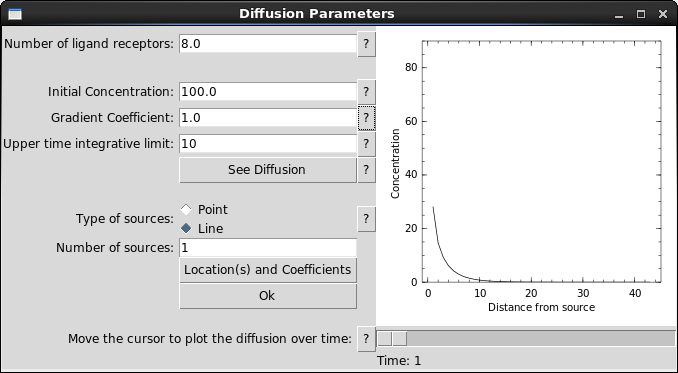
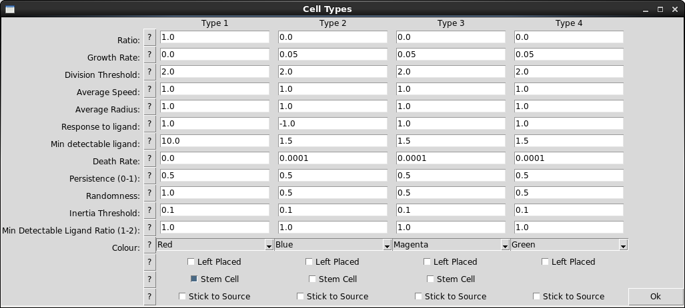

# abm-platform
[In development] A platform for agent-based modelling, written in Julia, for a Bioinformatics MSc group project.

Open the program by running "entry.jl"

This project allows the user to simulate a specified quantity of cells within a square or elliptical environment. At each timestep, a cell is chosen at random to be the subject of several functions:
* Cell Movement
* Cell Growth
* Cell Divison (if applicable)
* Cell Death

The parameters for these functions are specifiable by the user and are explained below.

## Main Screen
### Initialisation Options
It is possible to specify the starting conditions for the model in the main screen.

* Number of cells: The total number of cells at the start of the simulation.
* Number of timesteps: The total number of iterations made by the simulation.
* Height/Width of Environment: This denotes the size of the simulation environment in some arbitrary units.
* Stem Threshold: This specifies the concentration of ligand at which a reproducing stem cell will switch between self-replication and progenitor production
* Probability of cell death: At every timestep, the cell under scrutiny will have this chance to die and be removed from the simulation.
* Display Simulation: Selecting this option will produce an image of the simulation to the right hand side.
* Write to text: Selecting this option will save an output of the simulation to file.

## Diffusion Settings
These settings allow the user to alter the behaviour of ligand sources and their placement within the environment.

* Probability of Persistance: The chance that a cell will disregard the information about future moves from it surroundings and continue its movement.
* Numbers of direction: The amount of directions a cell can calculate possible moves in. They are spaced out evenly along the cell surface.
* Coefficients: Antoine needs to write this bit!!
* Type of source: Select which type of source is required.
* Number of sources: The total number of sources present in the simulation from the start.
* Source Locations: Allows the user to select the locations of each possible source.
* Diffusion Over Time: Antoine again?

## Cell Settings
The simulation allows for 4 different cell types, but can run with only one.

* Ratio: The ratio of the total number of cells given over to that type upon the start of the simulation. Ratios are normalised and as such do not have to sum to one.
* Growth Rate: The rate at which a cells area will increase per timestep.
* Division Threshold: The ratio of current area to initial area at which a cell division event will occur.
* Average Speed: The average distance a cell can travel in one step. Uses the same arbitrary units as other distance variables.
* Average Radius: The average radius of cells at the start of a simulation. This is also used in calculating cell division.
* Conc. Response: This specifies a value which multiplies a cells proposed move direction in response to its detected ligand concentration. A value of 1 indicates that a cell will travel towards a source, whilst -1 will repel the cell. Note that specified randomness will dilute this effect.
* Randomness: The percentage of a cells move that will be random.
* Colour: Possible cell type colours are: Red('ro'), Blue('bo'), Purple('mo'), Green('go') and Yellow('yo').
* Left Placed: Selecting this option will initialise all cells of the particular time close to the left wall of the environment.
* Stem Cell: Selecting this option will allow this type of cell to have stem cell behaviour. A stem cell will change the type of its progeny depending upon its local ligand concentration and the stem threshold specified in the main menu. Progeny will be either of the same type (stem cell replication), or the type below (1 -> 2 -> 3 -> 4). Note that type 4 cells cannot be stem cells. Unselecting this option means that all types will only produce the same type.

## Border Settings
This window allows the specification of each border within the environment.

* Reflecting: Cells will bounce off these walls.
* Absorbing: Upon contact, these cells will stick to these walls.
* Killing: Upon contact, these cells will die and be removed from the simulation.

